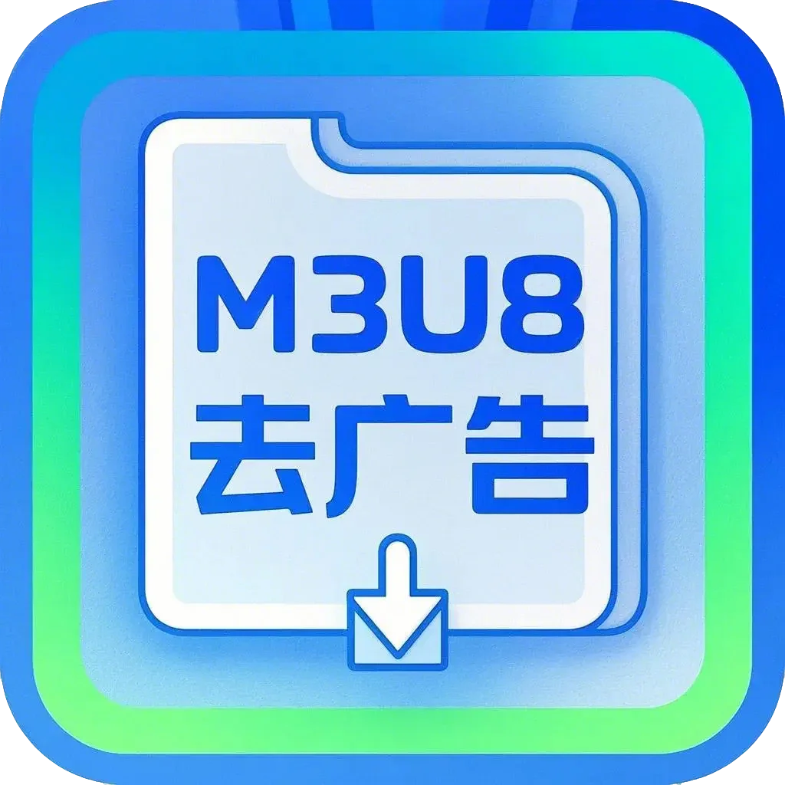

# AdFreeM3U8

    

一个用于下载和分析M3U8视频的Python工具。

## 功能特点

- 支持M3U8视频下载
- 自动分析M3U8文件
- 无广告下载体验
- 支持HTTP/HTTPS代理
- 支持批量下载

## 系统要求

- Windows操作系统
- 依赖 [N_m3u8DL-RE](https://github.com/nilaoda/N_m3u8DL-RE/releases) 下载工具

## 使用方法

1. 下载软件
2. 下载 [N_m3u8DL-RE.exe](https://github.com/nilaoda/N_m3u8DL-RE/releases) 并放置在软件同目录下
3. 运行软件，按照提示输入相关参数

### 基本设置
- M3U8链接：输入需要下载的视频链接
- 线程数：设置下载线程数（默认16）
- 保存目录：选择视频保存位置

### 代理设置
- 启用代理：勾选复选框启用代理
- 代理地址：输入HTTP/HTTPS代理地址（默认http://127.0.0.1:10809）

### 批量下载
1. 点击"批量下载"按钮
2. 选择包含M3U8链接的txt文本文件
3. 软件会自动逐个下载文件中的链接

## 注意事项

- 确保 N_m3u8DL-RE.exe 与软件在同一目录下
- 首次运行可能需要允许防火墙权限
- 使用代理时请确保代理服务器正常运行

## 许可证

MIT License 